# Baatu - Modern Communication Platform


## Table of Contents

- [Overview](#overview)
- [Features](#features)
- [Project Architecture](#project-architecture)
- [Technical Implementation](#technical-implementation)
- [Getting Started](#getting-started)
- [Dependencies](#dependencies)
- [Code Examples](#code-examples)
- [Contributing](#contributing)
- [Contact](#contact)
- [Acknowledgments](#acknowledgments)

## Overview

Baatu is a comprehensive communication platform designed to connect users through multiple channels. Built with Flutter, it offers a seamless cross-platform experience with a focus on performance, usability, and modern design principles.

## Features

- **Login and Registration**: Secure authentication with user-friendly interfaces..
- **Content Sections**: Explore various topics including grammar, music, and travel.
- **Interactive Navigation**: Easily navigate through different screens using the navigation bar.
- **Real-time Messaging**: Connect with other users through instant messaging.
- **Audio & Video Calls**: High-quality communication with multiple participant support.
- **Content Sharing**: Share media and documents seamlessly.
- **Offline Support**: Access key features even without an internet connection.
- **Cross-Platform**: Available on iOS, Android, Web, macOS, Windows, and Linux.

## Project Architecture

Baatu follows a modular architecture pattern to ensure maintainability, scalability, and separation of concerns.

## Screenshots

## Screenshots

| Authentication                                         | Account Management                                       | Main Features                                      | User Experience                                       |
| ------------------------------------------------------ | -------------------------------------------------------- | -------------------------------------------------- | ----------------------------------------------------- |
| 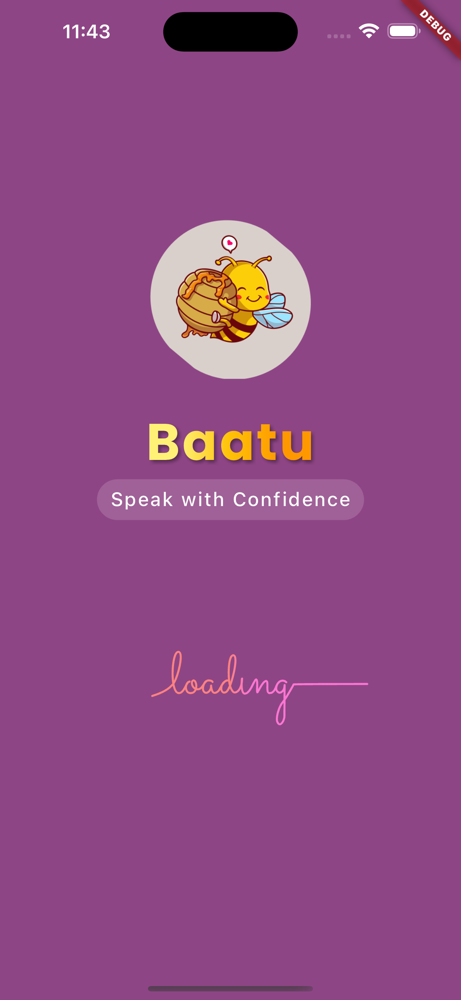   | 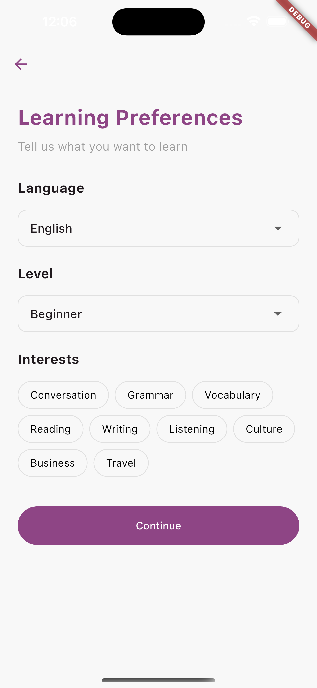 | 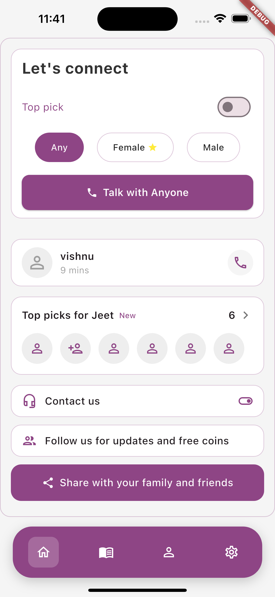 | 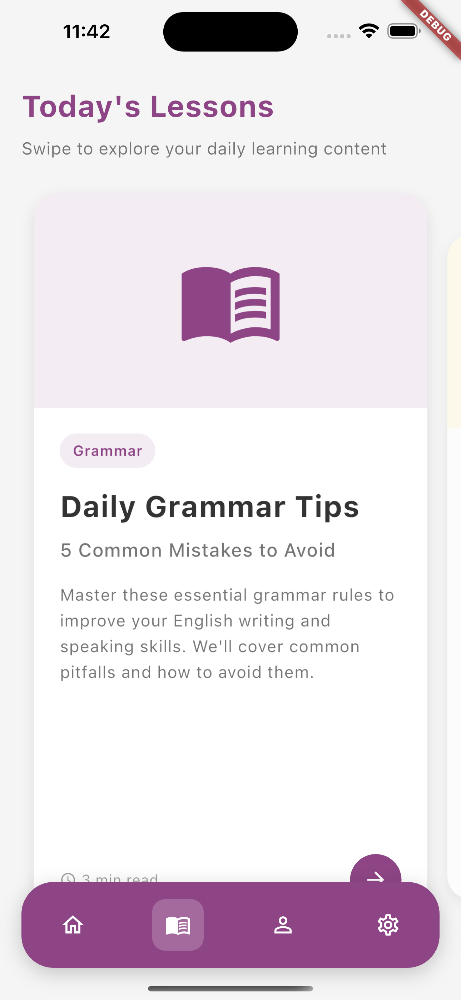  |
| 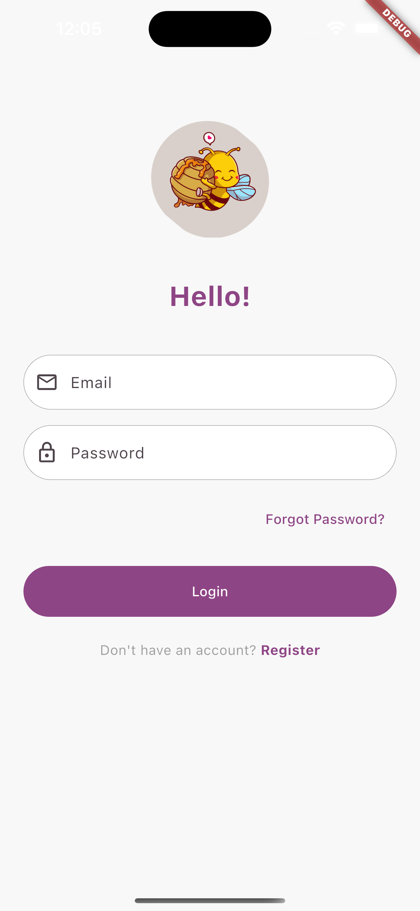    | 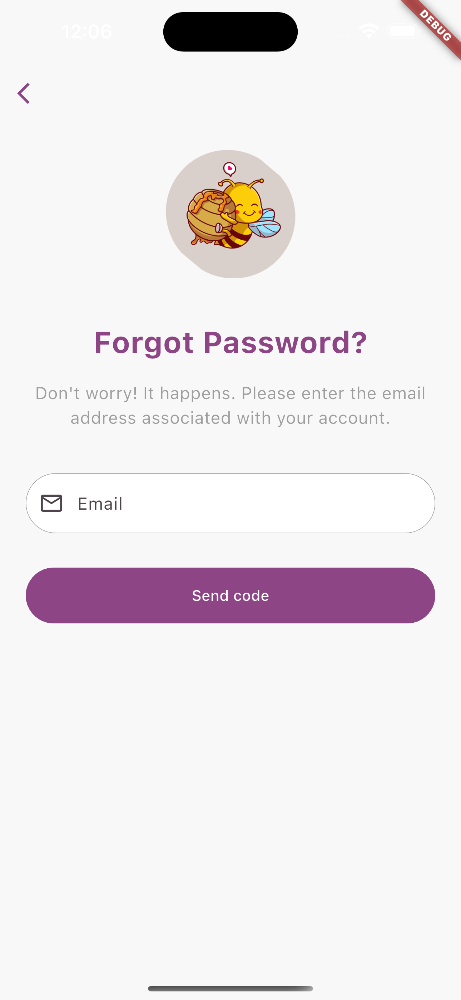     |  | 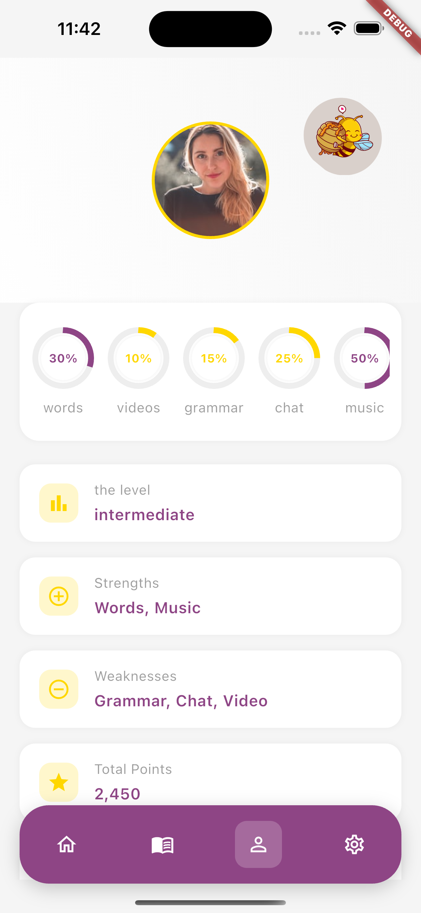 |
| 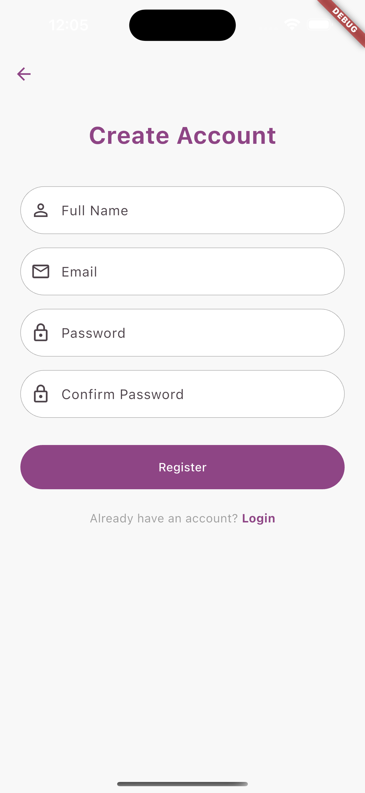 | 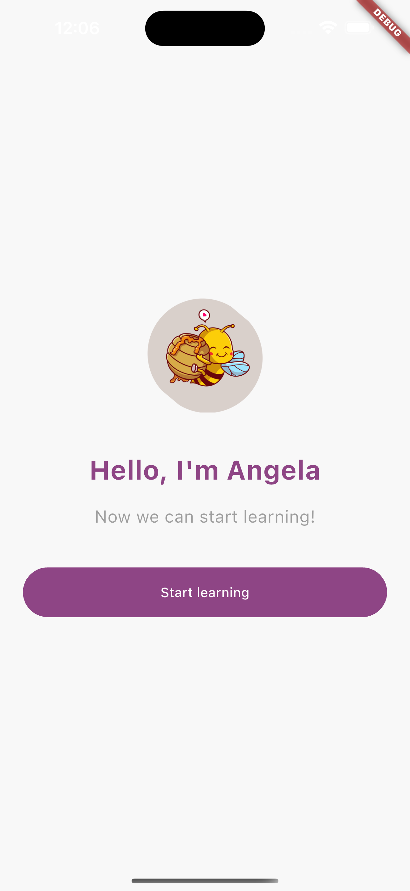    | 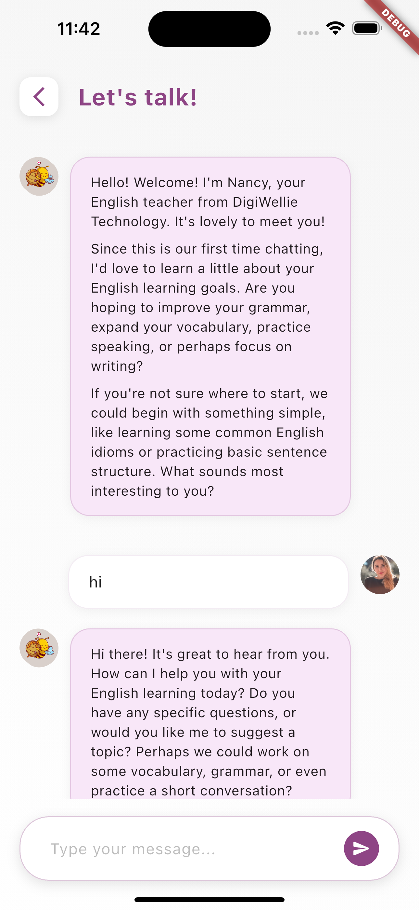 | 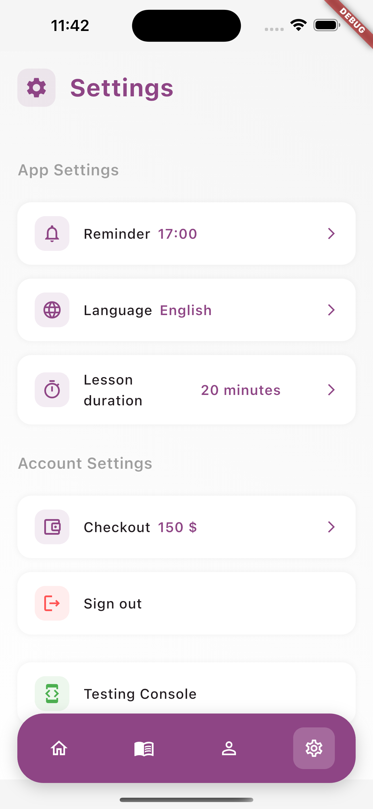 |

<!-- ### Account Management

<div style="display: flex; flex-wrap: wrap; gap: 15px; justify-content: center">
  
  
  
</div>

### Main Features

<div style="display: flex; flex-wrap: wrap; gap: 15px; justify-content: center">
  
  
  
</div>

### User Experience

<div style="display: flex; flex-wrap: wrap; gap: 15px; justify-content: center">
  
  
  
</div> -->

## Technical Implementation

Baatu is built using Flutter, a popular open-source UI toolkit for building natively compiled applications for mobile, web, desktop, and embedded devices. The app follows a clean architecture pattern to ensure maintainability, scalability, and separation of concerns.

## Project Architecture

Baatu follows a modular architecture pattern to ensure maintainability, scalability, and separation of concerns.

### Folder Structure

```
baatu/
├── android/                 # Android-specific configuration
├── ios/                     # iOS-specific configuration
├── lib/
│   ├── config/              # App configuration files
│   │   ├── constants/       # App constants
│   │   ├── routes/          # Route definitions
│   │   └── themes/          # Theme configurations
│   ├── core/                # Core functionality
│   │   ├── error/           # Error handling
│   │   ├── network/         # Network services
│   │   └── utils/           # Utility functions
│   ├── data/
│   │   ├── models/          # Data models
│   │   ├── repositories/    # Data repositories
│   │   └── services/        # API services
│   ├── modules/             # Feature modules
│   │   ├── auth/            # Authentication module
│   │   │   ├── components/  # UI components
│   │   │   ├── screens/     # Screens
│   │   │   ├── services/    # Module-specific services
│   │   │   └── models/      # Module-specific models
│   │   ├── chat/            # Chat module
│   │   ├── calls/           # Calls module
│   │   │   ├── audio_call/  # Audio call functionality
│   │   │   └── video_call/  # Video call functionality
│   │   └── profile/         # Profile module
│   ├── shared/
│   │   ├── components/      # Shared UI components
│   │   ├── widgets/         # Reusable widgets
│   │   └── helpers/         # Helper functions
│   └── main.dart            # Application entry point
├── assets/                  # Static assets
│   ├── images/              # Image assets
│   ├── fonts/               # Font files
│   └── icons/               # Icon assets
├── test/                    # Test files
└── pubspec.yaml             # Dependencies and app metadata
```

### Module Structure

Each module follows a consistent structure:

```
module_name/
├── components/              # UI components specific to the module
├── screens/                 # Screen widgets
├── services/                # Module-specific services
├── models/                  # Data models for the module
└── module_name.dart         # Module entry point
```

## Technical Implementation

### State Management

Baatu uses a combination of state management solutions:

```dart
// Example of state management with Provider
class UserProvider extends ChangeNotifier {
  User? _currentUser;

  User? get currentUser => _currentUser;

  void setUser(User user) {
    _currentUser = user;
    notifyListeners();
  }

  void logout() {
    _currentUser = null;
    notifyListeners();
  }
}
```

### Theme Management

The app implements a consistent theming system:

```dart
// Theme configuration
class AppTheme {
  static ThemeData lightTheme = ThemeData(
    primaryColor: AppColors.primary,
    colorScheme: ColorScheme.light(
      primary: AppColors.primary,
      secondary: AppColors.secondary,
      background: AppColors.background,
    ),
    textTheme: TextTheme(
      headlineLarge: TextStyle(
        fontSize: 24,
        fontWeight: FontWeight.bold,
        color: AppColors.textPrimary,
      ),
      // ... other text styles
    ),
    // ... other theme properties
  );

  static ThemeData darkTheme = ThemeData(
    // Dark theme configuration
  );
}
```

### Navigation

The app uses named routes for navigation:

```dart
// Route configuration
class AppRoutes {
  static const String splash = '/';
  static const String login = '/login';
  static const String register = '/register';
  static const String home = '/home';
  static const String chat = '/chat';
  static const String videoCall = '/video_call';
  static const String audioCall = '/audio_call';
  static const String profile = '/profile';

  static Map<String, WidgetBuilder> getRoutes() {
    return {
      splash: (context) => const SplashScreen(),
      login: (context) => const LoginScreen(),
      register: (context) => const RegisterScreen(),
      home: (context) => const HomeScreen(),
      chat: (context) => const ChatScreen(),
      videoCall: (context) => const VideoCallScreen(),
      audioCall: (context) => const AudioCallScreen(),
      profile: (context) => const ProfileScreen(),
    };
  }
}
```

### API Integration

The app uses a service-based approach for API integration:

```dart
// API service example
class ApiService {
  final String baseUrl = 'https://api.baatu.com';
  final http.Client client;

  ApiService({http.Client? client}) : client = client ?? http.Client();

  Future<dynamic> get(String endpoint) async {
    final response = await client.get(
      Uri.parse('$baseUrl/$endpoint'),
      headers: {'Content-Type': 'application/json'},
    );

    if (response.statusCode == 200) {
      return jsonDecode(response.body);
    } else {
      throw Exception('Failed to load data: ${response.statusCode}');
    }
  }

  // Other HTTP methods (post, put, delete, etc.)
}
```

### Real-time Communication

For real-time features like chat and calls, the app uses WebSockets and the Agora SDK:

```dart
// Audio call implementation
class AudioCallScreen extends StatefulWidget {
  final String channelName;
  final ClientRoleType role;

  const AudioCallScreen({
    Key? key,
    required this.channelName,
    required this.role,
  }) : super(key: key);

  @override
  State<AudioCallScreen> createState() => _AudioCallScreenState();
}

class _AudioCallScreenState extends State<AudioCallScreen> {
  late final RtcEngine _engine;
  bool _muted = false;

  @override
  void initState() {
    super.initState();
    _initializeAgora();
  }

  Future<void> _initializeAgora() async {
    // Initialize Agora SDK
    _engine = createAgoraRtcEngine();
    await _engine.initialize(RtcEngineContext(
      appId: AppConstants.agoraAppId,
      channelProfile: ChannelProfileType.channelProfileLiveBroadcasting,
    ));

    // Enable audio
    await _engine.enableAudio();

    // Join channel
    await _engine.joinChannel(
      token: '',
      channelId: widget.channelName,
      uid: 0,
      options: ChannelMediaOptions(
        clientRoleType: widget.role,
      ),
    );
  }

  // ... rest of implementation
}
```

## Getting Started

### Prerequisites

- Flutter SDK: ^3.6.0
- Dart SDK: ^3.0.0
- Android Studio / Xcode for native development

### Installation

1. Clone the repository:

   ```bash
   git clone https://github.com/yourusername/baatu.git
   ```

2. Navigate to the project directory:

   ```bash
   cd baatu
   ```

3. Install dependencies:

   ```bash
   flutter pub get
   ```

4. Run the app:
   ```bash
   flutter run
   ```

## Dependencies

- Flutter SDK: ^3.6.0
- Cupertino Icons: ^1.0.8
- Flutter SVG: ^2.0.9
- Google Fonts: ^6.1.0
- HTTP: ^1.1.0
- Provider: ^6.0.5
- Agora RTC Engine: ^6.2.0
- Firebase Core: ^2.15.0
- Firebase Auth: ^4.7.2
- Cloud Firestore: ^4.8.4
- Shared Preferences: ^2.2.0
- Path Provider: ^2.1.0
- Image Picker: ^1.0.2

## Code Examples

### Custom Button Component

```dart
class CustomButton extends StatelessWidget {
  final String text;
  final VoidCallback onPressed;
  final bool isLoading;
  final Color? backgroundColor;
  final Color? textColor;

  const CustomButton({
    Key? key,
    required this.text,
    required this.onPressed,
    this.isLoading = false,
    this.backgroundColor,
    this.textColor,
  }) : super(key: key);

  @override
  Widget build(BuildContext context) {
    final theme = Theme.of(context);

    return ElevatedButton(
      onPressed: isLoading ? null : onPressed,
      style: ElevatedButton.styleFrom(
        backgroundColor: backgroundColor ?? theme.primaryColor,
        padding: const EdgeInsets.symmetric(vertical: 16),
        shape: RoundedRectangleBorder(
          borderRadius: BorderRadius.circular(8),
        ),
      ),
      child: isLoading
          ? const CircularProgressIndicator(color: Colors.white)
          : Text(
              text,
              style: TextStyle(
                color: textColor ?? Colors.white,
                fontSize: 16,
                fontWeight: FontWeight.bold,
              ),
            ),
    );
  }
}
```

### Firebase Authentication Service

```dart
class AuthService {
  final FirebaseAuth _auth = FirebaseAuth.instance;

  // Get current user
  User? get currentUser => _auth.currentUser;

  // Auth state changes stream
  Stream<User?> get authStateChanges => _auth.authStateChanges();

  // Sign in with email and password
  Future<UserCredential> signInWithEmailAndPassword({
    required String email,
    required String password,
  }) async {
    try {
      return await _auth.signInWithEmailAndPassword(
        email: email,
        password: password,
      );
    } catch (e) {
      throw Exception('Failed to sign in: $e');
    }
  }

  // Register with email and password
  Future<UserCredential> registerWithEmailAndPassword({
    required String email,
    required String password,
  }) async {
    try {
      return await _auth.createUserWithEmailAndPassword(
        email: email,
        password: password,
      );
    } catch (e) {
      throw Exception('Failed to register: $e');
    }
  }

  // Sign out
  Future<void> signOut() async {
    await _auth.signOut();
  }
}
```

## Contributing

Contributions are welcome! Please fork the repository and submit a pull request for any enhancements or bug fixes.

1. Fork the repository
2. Create your feature branch (`git checkout -b feature/amazing-feature`)
3. Commit your changes (`git commit -m 'Add some amazing feature'`)
4. Push to the branch (`git push origin feature/amazing-feature`)
5. Open a Pull Request

## Contact

For any inquiries, please contact the project maintainers.

## Acknowledgments

Special thanks to all contributors and the Flutter community for their support.

---

© 2023 Baatu. All rights reserved.
